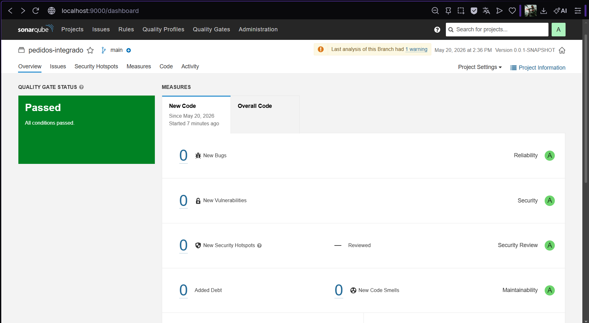
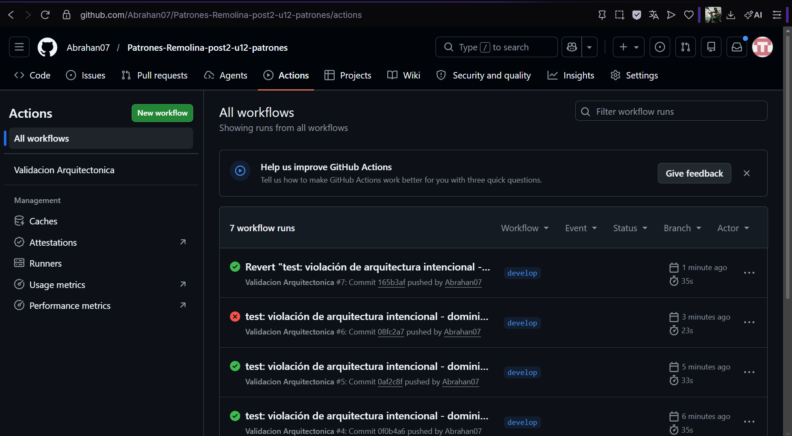

# Unidad 12: Integración de Patrones y Arquitecturas

Sistema de gestión de pedidos del Post-Contenido 1 extendido con validación arquitectónica mediante ArchUnit, documentación de decisiones de diseño en formato ADR, y verificación automática en un pipeline de GitHub Actions.

---

## Validación Arquitectónica con ArchUnit

Se implementaron 5 reglas arquitectónicas ejecutables en la clase `ReglasArquitectura` que verifican automáticamente que el diseño del sistema se mantiene íntegro en cada commit.

### Regla 1 — El dominio no depende de infraestructura ni adaptadores

El paquete `dominio` no debe importar ni depender de clases de `infraestructura`, `adaptadores`, `javax.persistence` ni `org.springframework.mail`. Esta regla garantiza que el dominio permanece aislado y testeable sin contenedor Spring.

### Regla 2 — Los controladores solo dependen de la Facade

Las clases del paquete `adaptadores.rest` solo pueden depender de `adaptadores.facade`, `dominio`, y paquetes de Spring Web. Esta regla garantiza que el controlador REST no conoce la lógica interna del sistema.

### Regla 3 — Los puertos de dominio son interfaces

Todas las clases del paquete `dominio.puertos` deben ser interfaces. Esta regla garantiza que los puertos definen contratos sin implementación concreta en el dominio.

### Regla 4 — Los procesadores implementan ProcesadorPedido

Todas las clases del paquete `adaptadores.procesadores` deben implementar la interfaz `ProcesadorPedido`. Esta regla garantiza que todos los procesadores cumplen el contrato del patrón Strategy.

### Regla 5 — La infraestructura no accede a los adaptadores REST

Las clases del paquete `infraestructura` no pueden acceder a clases del paquete `adaptadores.rest`. Esta regla garantiza que la infraestructura no tiene dependencias hacia la capa de presentación.

### Ejecutar las reglas localmente

```bash
# Ejecutar solo las reglas de arquitectura
./mvnw test -Dtest=ReglasArquitectura

# Salida esperada
[INFO] Tests run: 5, Failures: 0, Errors: 0, Skipped: 0
```

---

## Pipeline de GitHub Actions

El archivo `.github/workflows/arquitectura.yml` ejecuta automáticamente las reglas ArchUnit en cada push a `main` o `develop` y en cada pull request a `main`.

### Evidencia del pipeline

**Pipeline en rojo — violación de arquitectura detectada:**



**Pipeline en verde — tras revertir la violación:**



### Prueba de violación intencional

Se introdujo una violación intencional agregando una dependencia de `NotificacionEmail` (infraestructura) en la clase `Pedido` (dominio). El pipeline detectó la violación con el mensaje:

```
Architecture Violation - Rule 'no classes that reside in a package ..dominio..
should depend on classes that reside in ..infraestructura..'
```

La violación fue revertida con `git revert` y el pipeline volvió a pasar en verde.

---

## Decisiones de Diseño (ADR)

Los tres ADRs documentan las decisiones arquitectónicas más importantes del sistema. Se encuentran en la carpeta `docs/adr/`.

### ADR-001 — Arquitectura Hexagonal para aislar el dominio

**Estado:** Aceptado — 2026-05-20

El dominio define puertos (interfaces) y no importa ninguna clase de Spring ni de JPA. Los adaptadores e infraestructura implementan los puertos. Esta decisión permite que el dominio sea testeable con Mockito sin contenedor Spring y que cambiar de JPA a otro motor de persistencia requiera solo un nuevo adaptador.

### ADR-002 — Factory + Strategy para selección de procesador

**Estado:** Aceptado — 2026-05-20

Se usa el patrón Strategy (interfaz `ProcesadorPedido` con una implementación por tipo) combinado con Factory (mapa de instancias inyectadas por Spring) para selección en tiempo de ejecución. Agregar un nuevo tipo de pedido solo requiere crear una nueva clase sin modificar código existente.

### ADR-003 — Spring Events (Observer) para notificaciones desacopladas

**Estado:** Aceptado — 2026-05-20

Se usa `ApplicationEventPublisher` para publicar `PedidoProcesadoEvent`. Cada canal de notificación implementa un `@EventListener` independiente. `FachadaPedidos` no conoce quién escucha el evento, lo que permite agregar nuevos canales sin modificar el servicio.

---

## Estructura del Proyecto

```
com.empresa.pedidos/
├── dominio/               → Entidades, enums, eventos y puertos (interfaces)
├── aplicacion/            → Factory para selección dinámica de procesadores
├── infraestructura/       → Persistencia JPA y listeners de notificación
└── adaptadores/
    ├── procesadores/      → Implementaciones Strategy
    ├── facade/            → Facade que unifica operaciones
    └── rest/              → Controlador REST

docs/adr/
├── ADR-001.md             → Arquitectura Hexagonal
├── ADR-002.md             → Factory + Strategy
└── ADR-003.md             → Observer con Spring Events

.github/workflows/
└── arquitectura.yml       → Pipeline de validación arquitectónica
```

---

